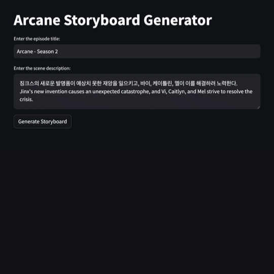
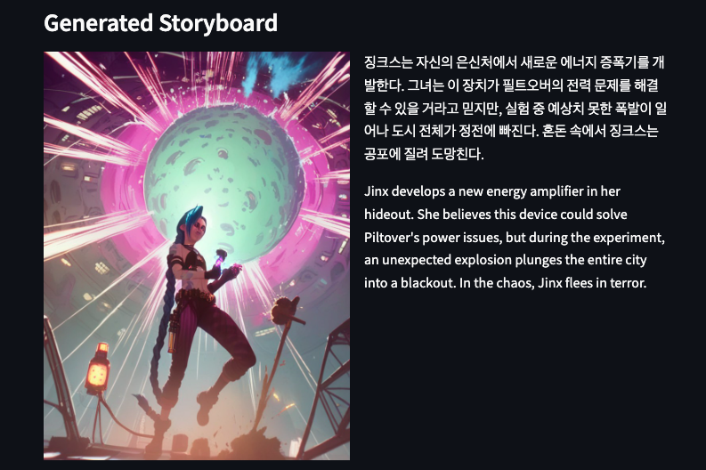
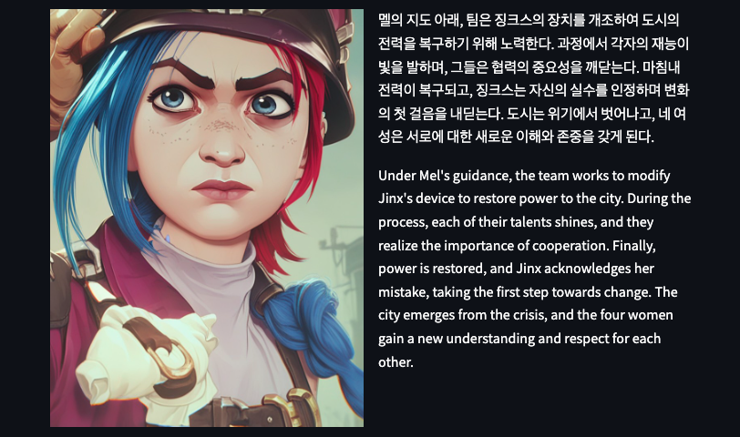

# Animation Storyboard Generator

Generate an animation storyboard from a text prompt. It uses Claude 3.5 Sonnet and Stable Diffusion XL LoRA.



|  |  |
|:---:|:---:|
|  |  |
|  |  |
|  |  |

# How to run

```
pip install -r requirements.txt
streamlit run main.py
```

## References

- [Claude 3.5 Sonnet](https://www.anthropic.com/claude)
- [Arcane Style and Characters | All-in-One LoRA | Jinx Vi Mel Caitlyn](https://civitai.com/models/407381?modelVersionId=720821)
